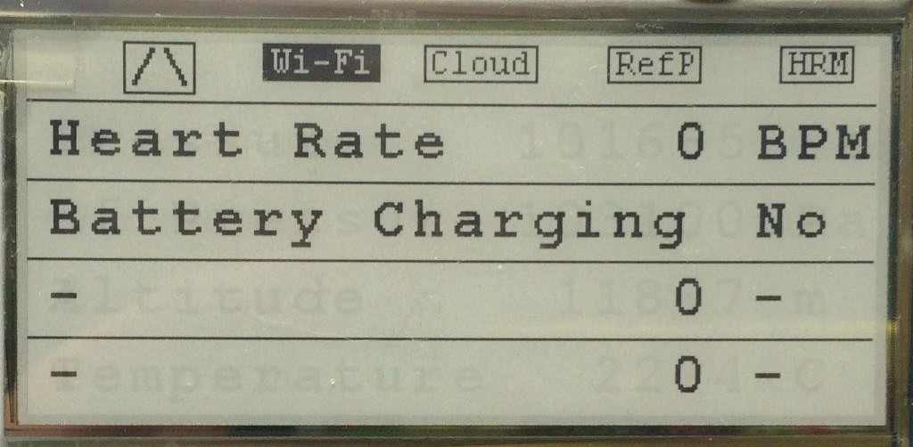

# esp32-everest-run-badge

Internet connected altimeter for Everest Run - http://everestrun.pl/

To reach the top of [Mount Everest](https://en.wikipedia.org/wiki/Mount_Everest), it usually takes years of preparation and thousands $ spent on equipment. [Everest Run](http://everestrun.pl/) makes it far more achievable and easier by letting you climb the highest peak of the Earth in the center of Warsaw! Well, far easier but still tough. To make it, you need to climb 2730 floors and it takes at [least 14 hours](http://everestrun.pl/wyniki-on-line-mer-2016/).

Being an engineer I decided to put together a little companion for this challenge.

This is continuation and expansion of similar project [esp32-everest-run](https://github.com/krzychb/esp32-everest-run) using new hardware. Please check original project's [log book](https://github.com/krzychb/esp32-everest-run/blob/master/log-book.md) for the short story how it was developed.

## Components

* [SHA2017 Badge](https://twitter.com/sha2017badge), a great piece of hardware developed for SHA2017 hacker camp/conference that took place in The Netherlands in 2017
* [BMP180](https://www.bosch-sensortec.com/bst/products/all_products/bmp180) Barometric Pressure Sensor
* [Polar H7](http://www.trustedreviews.com/reviews/polar-h7-heart-rate-sensor) Polar H7 Heart Rate Sensor with Bluetooth
* [esp-idf](https://github.com/espressif/esp-idf) Espressif IoT Development Framework for ESP32

## Build Status

## Altitude Measurements On-line

Test data feed is available under https://thingspeak.com/channels/208884

## Installation Overview

Configure your PC according to [ESP32 Documentation](http://esp-idf.readthedocs.io/en/latest/?badge=latest). [Windows](http://esp-idf.readthedocs.io/en/latest/get-started/windows-setup.html), [Linux](http://esp-idf.readthedocs.io/en/latest/get-started/linux-setup.html) and [Mac OS](http://esp-idf.readthedocs.io/en/latest/get-started/macos-setup.html) are supported.

You can compile and upload code to ESP32 from command line with [make](http://esp-idf.readthedocs.io/en/latest/get-started/make-project.html) or using [Eclipse IDE](http://esp-idf.readthedocs.io/en/latest/get-started/eclipse-setup.html).

If this is you first exposure to ESP32 and [esp-idf](https://github.com/espressif/esp-idf), then get familiar with [hello_world](https://github.com/espressif/esp-idf/tree/master/examples/get-started/hello_world) and [blink](https://github.com/espressif/esp-idf/tree/master/examples/get-started/blink) examples. In next step check more advanced examples that have been specifically used to prepare this application: [http_request](https://github.com/espressif/esp-idf/tree/master/examples/protocols/http_request) and [sntp](https://github.com/espressif/esp-idf/tree/master/examples/protocols/sntp).

Compilation and upload of this application is done in the same way like the above examples.

## Application Software Overview

This application is performing measurements and calculations every couple of seconds. Results are then displayed on the badge and send to the cloud. When not doing any of theses tasks, the ESP32 is put to sleep mode to save the battery power. The functions representing tasks executed after wakeup are listed in `app_main()` of [main/altimeter-main.c](main/altimeter-main.c) source file:

* `update_reference_pressure()` - retrieval of atmospheric reference pressure from [api.openweathermap.org](http://openweathermap.org/api) service. This reference pressure is one of input parameters to calculate the altitude.
* `measure_altitude()` - calculation of the altitude basing on pressure value read from the BMP180 sensor and the reference atmospheric pressure.
* `update_heart_rate()` - retrieval of the heart rate from Polar H7 Heart Rate Monitor.
* `measure_battery_voltage()` - measure the battery voltage and charging status.
* `update_display()` - update of badge's display to show the altitude climbed, heart rate, up time, as well as couple of other parameters that represent measurements or communication error rates.
* `publish_measurements()` - send the key measurements to ThinkSpeak cloud service.

On a slightly lower level, execution of the above functions is implemented using couple of ESP-IDF components listed in [components](components) folder:

* [altimeter](components/altimeter) - this components contains implementation of the above functions
* [badge](components/badge) - drivers for the badge hardware like ePaper display, MPR121 Proximity Capacitive Touch
Sensor Controller, SPI driven LEDs, vibrator motor, etc.
* [badge_bmp180](components/badge_bmp180) - driver to read BMP180 Barometric Pressure Sensor connected to the extension port of the badge
* [epaper-29-dke](components/epaper-29-dke) - driver for the ePaper display integrated into the badge
* [http](components/http) - http client to manage communication with cloud services like OpenWeatherMap or ThingSpeak
* [polar-h7-client](components/polar-h7-client) - BLE (Bluetooth Low Energy) driver to retrieve heart rate measurements from the Polar H7 sensor
* [thingspeak](components/thingspeak) - application to send data to [ThinkSpeak](https://thingspeak.com/channels/208884) cloud service
* [weather](components/weather) - application to retrieve reference pressure for [OpenWeatherMap](http://openweathermap.org/api) service
* [wifi](components/wifi) - routines to set up and manage Wi-Fi connection of the ESP32

## How it Looks like

|  |  |
|:---:|:---:|
| Climbed / Descent screen | Pressure / Altitude screen |

|  |  |
|:---:|:---:|
| Heart Rate screen | Communication Errors screen |

|  |  |
|:---:|:---:|
| SHA2017 Badge back | BMP Barometric Pressure Sensor mounting |

## Typical Measurements

Charts below present measurements when climbing InterContinetal hotel in Warsaw. The start is at floor -5 and finish at floor 43, the total of 48 floors. I made this distance 7 times. I was going down with an elevator except one time when I decided to walk. This is visible on chart "Altitude" as fourth peak from the left. 

Total altitude climbed and descent is shown on next two charts below.

The last two charts present application up time and battery voltage.

## MER 2018 Measurements

On 20 January 2017 from 13:00 till 23:20 I have been climbing Marriott hotel in Warsaw during [Marriott Everest Run](http://everestrun.pl/). The start was at floor -1 and finish at floor 41, the total of 42 floors or 136.5 meters. I made this distance 33 times climbing total of 4504.5 m in 10 hours and 20 min. 

|  |  |
|:---:|:---:|
| MER 2018 - measurement of altitude | MER 2018 - measurement of heart rate |

Total altitude climbed and descent is shown on next two charts below.

|  |  |
|:---:|:---:|
| MER 2018 - measurement of altitude climbed | MER 2018 - measurement of altitude descent |

The altitude is calculated basing on pressure measured with BM180 sensor, see chart on the left, and reference pressure obtained from the OpenWeatehrMap service, see chart on the right. During MER 2018 the reference pressure was going slowly down, that is visible on both charts. The OpenWeatherMap provides resolution of measurement of 100 Pa that is visible in step changes on the chart on the right. As result of each step change of the reference pressure there was a corresponding step change of the altitude (see chart above) of about 10 m. In next application I am going to switch to service that provides 10 Pa o better resolution of the reference pressure.

|  |  |
|:---:|:---:|
| MER 2018 - measurement of pressure | MER 2018 - measurement of reference pressure |

The last two charts present application up time and SHA 2017 badge battery voltage.

|  |  |
|:---:|:---:|
| MER 2018 - measurement of up time | MER 2018 - measurement of battery voltage |

In first five hours I was able reach the top 15 times. In the remaining 4 hours 20 min I made it 18 times because there were less people climbing and queues to two elevators taking us down were much shorter.

|  |  |
|:---:|:---:|
| MER 2018 - measurement of altitude during first half of climbing | MER 2018 - measurement of altitude during second half of climbing |

Climbing couple of thousands meters takes several hours and requires good physical and mental preparation. I am totally exhausted just after completion, kind of surprised I was able to do it and not sure I would do it again. Next day I am ready to do once more.

|  |  |
|:---:|:---:|
| Equipment for MER 2018 | Certification of completion of MER 2018 |

## Acknowledgments

This repository has been prepared thanks to great hardware and software developed by the following teams and individuals:

* [SHA2017 Badge Team](https://twitter.com/sha2017badge), love the hardware and the software you have carefully designed and implemented for SHA2017!
* [Fundacja Wsparcia Ratownictwa RK](https://www.facebook.com/FundacjaRK) organizing open for everybody weekly climbing trainings that concludes for several of participants in yearly [Marriott Everest Run](http://everestrun.pl/).
* Espressif team that develops and maintains [esp-idf](https://github.com/espressif/esp-idf)  repository. With each update I am each time amazed, how stable this code works and how great functionality it provides.
* [esp-iot-solution](https://github.com/espressif/esp-iot-solution) team that developed clean and easy to follow [epaper](https://github.com/espressif/esp-iot-solution/tree/master/components/spi_devices/epaper/test) component for similar type of ePaper display like on SHA2017 Badge. I reused it almost entirely in this project.
* Waveshare that provides [great documentation](https://www.waveshare.com/wiki/2.9inch_e-Paper_Module) and [really user friendly demo code](https://www.waveshare.com/wiki/File:2.9inch_e-Paper_Module_code.7z). It was instrumental to help me understand how to control ePaper displays and adapt existing ESP-IDF code to control such displays.
* Serge Zaitsev who gave us a minimalistic JSON parser [jsmn](https://github.com/zserge/jsmn). In this repository jsmn is breaking down JSON strigns provided by api.openweathermap.org.
* [Andreas Spiess](https://twitter.com/spiessa), the great maker of things and videos that document his projects. His video [#173 ESP32 Bluetooth BLE with Arduino IDE (Tutorial) and Polar H7](https://www.youtube.com/watch?v=2mePPqiocUE) inspired me to use Polar H7 sensor in my project. Thanks to his tips integration of Polar H7 turned out to be quite easy job.
* [SpritesMods](http://spritesmods.com/), the [SPI Master driver](https://esp-idf.readthedocs.io/en/latest/api-reference/peripherals/spi_master.html) for ESP-IDF is a really nice piece of software:  versatile and fun to work with. And yes, it is driving ePaper displays with ease :) 
* Angus Gratton who's [http_request](https://github.com/espressif/esp-idf/tree/master/examples/protocols/http_request) was the key ingredient of my own version of the http client that talks to varius cloud services.
* Ivan Grokhotkov, who architects and develops great and robust code and supports impossible number of users. This is really inspiring!

## License

[Apache License Version 2.0, January 2004](LICENSE)